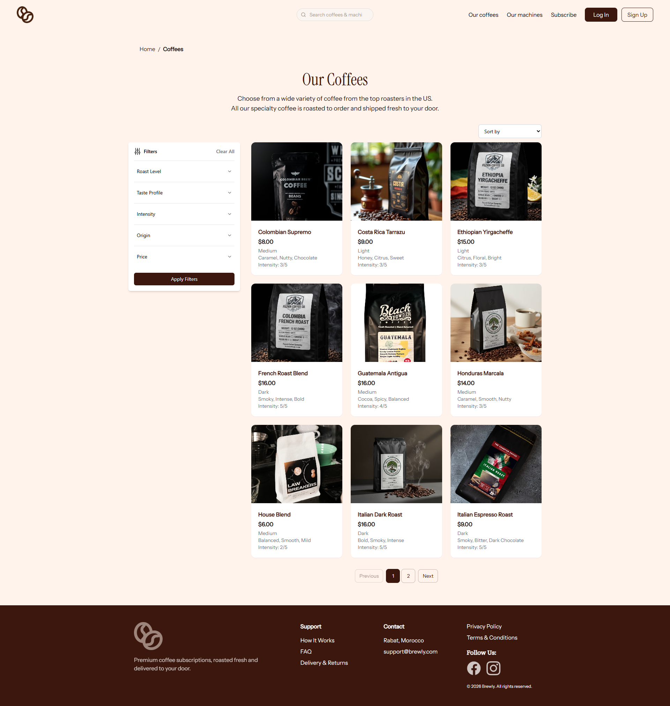
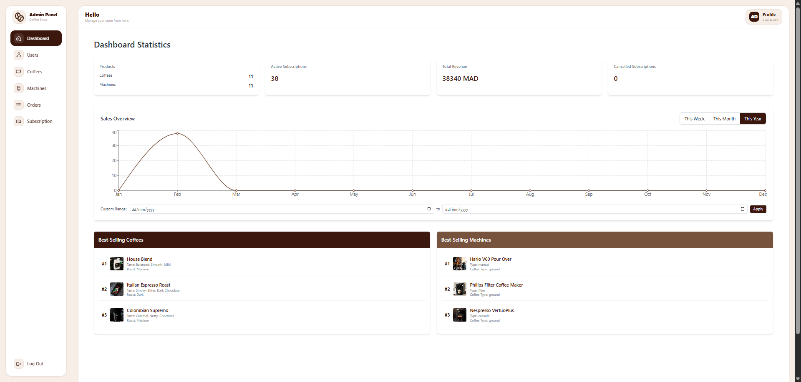

# ☕ Gold Beans


A full-stack premium coffee e-commerce platform built with the MERN
stack. The application supports one-time purchases, recurring
subscription plans, secure authentication, and a complete admin
dashboard.

## 📖 About The Project

Gold Beans is a modern full-stack e-commerce web application designed
for selling premium coffee and coffee machines with subscription
capabilities.

The platform provides a complete shopping experience for customers and a
powerful admin dashboard for managing products, users, orders, and
subscriptions.

## ✨ Features

### 👤 User Features

-   Secure registration and login (JWT authentication)
-   Account activation and password reset via email
-   Browse coffee products and coffee machines
-   Add products to cart and place orders
-   Subscribe to recurring coffee delivery plans
-   View order history and active subscriptions
-   Upload and update profile avatar
-   Manage personal account information

### 🧑‍💼 Admin Features

-   Admin dashboard with full platform control
-   Manage products, users, orders, and subscriptions
-   Upload product images

## 🛠️ Tech Stack
  
| Layer | Technology |
|---|---|
| Frontend | React.js, Tailwind CSS |
| Backend | Node.js, Express.js |
| Database | MongoDB, Mongoose |
| Auth | JWT (JSON Web Tokens) |
| File Uploads | Multer |
| Email | Nodemailer |
## 📁 Project Structure
```
Gold-Beans
├── backend
│   └── src
│       ├── config          # Database and JWT configuration
│       ├── controllers     # Route handler logic
│       ├── middlewares     # Auth, validation, upload, error handling
│       ├── models          # Mongoose schemas
│       ├── repositories    # Database query abstraction layer
│       ├── services        # Business logic layer
│       ├── utils           # Utility helpers (email, purchase types)
│       └── validators      # Request validation schemas
│
└── frontend
    └── src
        ├── api             # Axios API instances
        ├── components      # Reusable UI components
        │   └── common      # Shared components (Navbar, Footer, Cards, etc.)
        ├── contexts        # React context (Auth, Cart, Breadcrumb)
        └── pages
            ├── admin       # Admin dashboard pages
            ├── client      # Logged-in user pages
            └── public      # Public pages (Home, Coffees, Machines, Auth)
```
## 🧠 Architecture

Controller Layer → Handles HTTP requests\
Service Layer → Business logic\
Repository Layer → Database access\
Model Layer → Database schemas

## 🚀 Getting Started

### Prerequisites

Make sure you have the following installed:

- [Node.js](https://nodejs.org/) (v18+)
- [MongoDB](https://www.mongodb.com/) (local or Atlas)
- npm

---

### 1. Clone the Repository

```bash
git clone https://github.com/your-username/Gold-Beans.git
cd Gold-Beans
```

---

### 2. Backend Setup

```bash
cd backend
npm install
```

Create a `.env` file in the `backend/` directory and add the following:

```env
PORT=5000
MONGO_URI=your_mongodb_connection_string
JWT_SECRET=your_jwt_secret
JWT_EXPIRES_IN=7d

EMAIL_HOST=smtp.your-email-provider.com
EMAIL_PORT=587
EMAIL_USER=your_email@example.com
EMAIL_PASS=your_email_password

CLIENT_URL=http://localhost:3000
```

Start the backend server:

```bash
npm run dev
```

---

### 3. Frontend Setup

```bash
cd ../frontend
npm install
```

Create a `.env` file in the `frontend/` directory and add:

```env
REACT_APP_API_URL=http://localhost:5001/api
REACT_APP_API_URLL=http://localhost:5001
```

Start the frontend:

```bash
npm start
```

The app will be running at `http://localhost:3000`.

---


### Backend

cd backend\
npm install\
npm run dev

### Frontend

cd frontend\
npm install\
npm start

## 📸 Screenshots


| Home Page | Coffee Catalog | Admin Dashboard |
|---|---|---|
|  |  |  |

## 💡 Skills Demonstrated

-   Full-stack MERN development\
-   REST API design\
-   Authentication and authorization\
-   Database design\
-   File uploads\
-   Email integration\
-   Clean architecture


## 👥 Authors

- [@RedaSatrallah](https://github.com/RedaSatrallah)
- [@Amira-kilito](https://github.com/Amira-kilito)
- [@Hajarjam](https://github.com/Hajarjam)
- [@malakCH2003](https://github.com/malakCH2003)
- [@morabitihoussam](https://github.com/morabitihoussam)

------------------------------------------------------------------------

<p align="center">Made with ☕ by the Gold Beans team</p>
